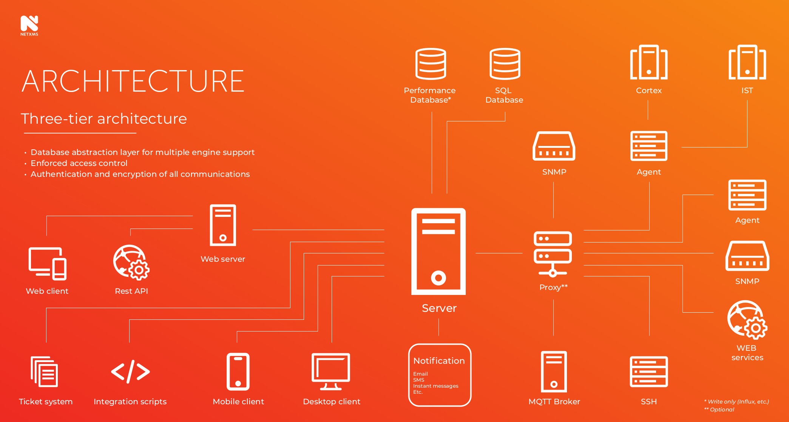

# NetXMS — Enterprise-Grade Monitoring

[](https://github.com/netxms/netxms/actions)
[](https://www.gnu.org/licenses/old-licenses/gpl-2.0.en.html)
[](https://contribute.design/)

NetXMS is an open-source network and infrastructure monitoring and management solution that provides comprehensive performance and availability monitoring with flexible event processing, alerting, reporting, and graphing for all layers of IT infrastructure. It's a unified solution that can monitor and manage your entire IT infrastructure — from network switches to applications — all in one place.

## 🚀 Quick Start

- **[Docker Setup](https://github.com/netxms/docker)** - Fastest way to get started 
- **[Download](https://www.netxms.org/download/)** - Get the latest release
- **[Documentation](https://www.netxms.org/documentation/adminguide/)** - Complete administration guide
- **[Ubuntu installation video](https://www.youtube.com/watch?v=jOVKc6y1dpE)** - Video tutorials and webinars
- **[Demo](https://www.youtube.com/watch?v=QhHznyOXEFk)** - NetXMS demo

## 🏗️ Architecture



NetXMS follows a distributed architecture with a central management server, monitoring agents, and web/desktop clients. The system supports multiple deployment scenarios from single-server setups to large distributed environments.

## ✨ Key Features

### 🌐 Network Monitoring

* **Auto-discovery**: Automatically discovers and adds network devices to NetXMS 
* **Protocol support**: SNMP (all versions), SSH, web services (XML, JSON, plain text)
* **Data collection**: Collects information via ARP caches, routing tables, switch forwarding databases, LLDP, CDP, STP
* **Real-time updates**: Automatically updates peer information for all registered hosts and devices
* **Advanced search**: Provides searches for specific MAC or IP addresses, wireless access points, and wireless clients
* **Network visualization**: Easy access to routing tables, MAC tables, VLAN information, IP route visualization, and network maps based on discovered data
* **Event correlation**: Topology-based event correlations for intelligent alerting
* **Change detection**: Configurable routing change detection
* **Device drivers**: Vendor-specific information handling and unified presentation

### 🖥️ User Interface

* **Multi-platform clients**: Desktop version available for Windows, macOS, and Linux
* **Web interface**: Full-featured web-based console
* **Flexible visualization**: Graphical network maps and user-configurable dashboards
* **Third-party integration**: REST API and Java library enable integration with external tools like [Grafana](https://grafana.com/), plus built-in fanout drivers for InfluxDB, ClickHouse

### 🖥️ Server and Workstation Monitoring

* **Universal agents**: Available for all popular platforms and operating systems
* **Centralized management**: Configuration and upgrades, minimal system resources usage
* **Proxy capabilities**: Acts as proxy for other agents and SNMP devices
* **Network-friendly**: Two connection options with agents outbound or inbound, single TCP port, encrypted communication with local cache for unstable connections
* **Log monitoring**: Real-time log file content analysis
* **Comprehensive metrics**: 
   * Network and I/O performance
   * Process, CPU, and memory consumption
   * Network services monitoring
   * Hardware sensors
   * Application-level metrics
   * Custom metrics support
   * And more...
* **Remote control**: Integrated remote desktop, file transfer, and command execution
* **User support tools**: Low-footprint helpdesk application with configurable actions, screenshots, and screencasts

### 🌍 Distributed Monitoring

* **Zone-based architecture**: Divides networks into zones with overlapping subnets and proxy agents
* **High availability**: Automatic load balancing and failover with multiple proxy agents per zone
* **Autonomous operation**: Continues data collection when central management server is unavailable
* **Event forwarding**: Receives syslog messages and SNMP traps for forwarding or local storage
* **Remote monitoring**: Single TCP port connectivity for server-to-proxy-agent communication

### 🔧 Built-in Scripting Engine (NXSL)

* **Advanced automation**: Enables sophisticated automation and management capabilities
* **Hook scripts**: Callable from multiple system locations for custom processing
* **Versatile applications**: Data transformation, complex thresholds, event processing, SNMP trap transformation
* **Easy-to-learn**: Non-strict typed interpreted language optimized for speed and low memory footprint
* **Secure execution**: Each script runs in isolated VM with controlled access
* **High performance**: Supports hundreds of simultaneous script executions

### 🔗 Integration Capabilities

* **Java API**: Complete Java API for full system control and UI replacement
* **REST API**: Access to collected data and NetXMS configuration
* **Modular architecture**: Extensible agents and servers via plugins
* **Python scripting**: Access to full Java API through Python
* **Helpdesk integration**: Built-in integration with helpdesk systems

### 🔐 Security Features

* **Flexible authentication**: Internal database or external LDAP directory integration
* **Multiple auth methods**: Passwords, X.509 certificates, smart cards, RADIUS, or LDAP
* **Two-factor authentication**: TOTP or one-time codes via SMS/instant messaging
* **Encrypted communications**: All network communications are encrypted
* **Access control**: Fine-grained access control configuration
* **Audit logging**: Extensive audit logs with optional external system integration

### 📊 Data and Event Processing

* **Policy-based processing**: Flexible event processing with customizable policies
* **Automated responses**: Alarm creation/termination, script execution, command execution
* **Multi-channel notifications**: Email, MS Teams, Telegram, Slack, SMS via GSM modem or gateway
* **Escalation support**: Configurable problem escalation workflows
* **Threshold management**: Flexible threshold system for data collection
* **Template-based configuration**: Simplified management of large networks

### 💼 Business Services

* **Business metrics translation**: Converts technical metrics to business language
* **SLA monitoring**: View vital SLA information at a glance
* **Service status calculation**: Based on monitored objects status or metric thresholds
* **Availability reporting**: Calculate business service availability for arbitrary time ranges
* **Downtime analysis**: Detailed downtime information including start/end times and causes

## 📦 Installation

> **Note**: Full installation documentation is available in our [Administration Guide](https://www.netxms.org/documentation/adminguide/installation.html).

### Quick Installation (Debian/Ubuntu)

We provide a public APT repository at http://packages.netxms.org/ for all Debian-based distributions. All packages are signed for security.

1. **Add NetXMS repository**:
   ```bash
   wget http://packages.netxms.org/netxms-release-latest.deb
   sudo dpkg -i netxms-release-latest.deb
   sudo apt-get update
   ```

2. **Install NetXMS components** (example for PostgreSQL):
   ```bash
   sudo apt-get install netxms-server netxms-dbdrv-pgsql
   ```

3. **Configure database connection** in `/etc/netxmsd.conf`

4. **Initialize database schema**:
   ```bash
   nxdbmgr init
   ```

5. **Start NetXMS server**:
   ```bash
   sudo systemctl start netxmsd
   sudo systemctl enable netxmsd
   ```

### Other Platforms

Installers for Windows, AIX, Solaris, and other platforms are available on [netxms.org](https://www.netxms.org/download/).

### Docker

```bash
# Quick start with Docker Compose
git clone https://github.com/netxms/netxms.git
cd netxms/contrib/docker
docker-compose up -d
```


## 📚 Documentation 

* **[Administration Guide](https://www.netxms.org/documentation/adminguide/)** - Complete setup and configuration guide
* **[Change Log](https://github.com/netxms/changelog/blob/master/ChangeLog.md)** - Latest changes and updates
* **[NetXMS Scripting Language (NXSL)](https://www.netxms.org/documentation/nxsl-latest/)** - Scripting reference
* **[Data Dictionary](https://www.netxms.org/documentation/datadictionary-latest/)** - Complete data reference
* **[Java API Documentation](https://www.netxms.org/documentation/javadoc/latest/)** - NxShell and Java API reference
* **[YouTube Channel](https://www.youtube.com/@netxms)** - Video tutorials and webinars


## 🆘 Support

### Community Support

* **[Forum](https://www.netxms.org/forum/index.php)** - Community discussions and help
* **[Telegram](https://telegram.me/netxms)** - Real-time chat support
* **[Issue Tracker](https://github.com/netxms/netxms/issues)** - Bug reports and feature requests

### Commercial Support

* **[Raden Solutions](https://netxms.com/commercial-support)** - Professional support and services

## 🤝 Contributing

We welcome contributions from the community! NetXMS follows an **issue-first** approach and values privacy, performance, and modular architecture.

**Before contributing, please read our guides:**

* **[CONTRIBUTING.md](CONTRIBUTING.md)** - Complete developer contribution guide
* **[DESIGN.md](DESIGN.md)** - Design contribution guidelines and resources

**CONTRIBUTING.md includes:**
* Project vision and core values
* Development priorities and guidelines
* Required issue-first workflow
* Code standards and testing requirements
* Development setup instructions

**DESIGN.md includes:**
* UI/UX design guidelines and resources
* Core UX Issues Needing Attention
* Target Audience 

Quick links for contributors:
* **[Report bugs](https://github.com/netxms/netxms/issues)** - Use our issue tracker
* **[Join discussions](https://www.netxms.org/forum/index.php)** - Community forum
* **[Get help](https://telegram.me/netxms)** - Real-time chat support

## 📄 License 

Most parts of NetXMS are licensed under the GNU General Public License, with some exclusions. See [COPYING](COPYING) for detailed information.

---

<div align="center">

**[Website](https://www.netxms.org) • [Download](https://www.netxms.org/download/) • [Documentation](https://www.netxms.org/documentation/) • [Demo](https://www.youtube.com/watch?v=QhHznyOXEFk)**

Made with ❤️ by the NetXMS community

</div>

